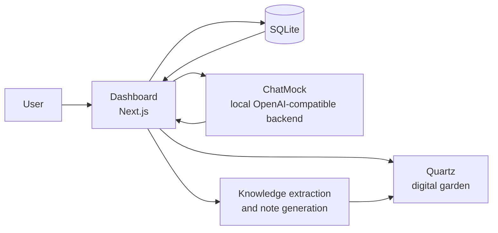

# Breadboard

<p align="center">
  <strong>A cluster-based second brain for ingesting documents, chatting with knowledge, and publishing a digital garden.</strong>
</p>

<p align="center">
  
  
  
  
  
  
</p>

---

## What is Breadboard?

**Breadboard** is a multi-service knowledge workspace built around a simple idea:

> turn raw material into structured knowledge, then make it explorable.

It combines:

- a **private dashboard** for managing clusters
- a **local AI bridge** for model access
- a **knowledge ingestion pipeline** for uploaded sources
- a **Quartz-powered digital garden** for browsing and publishing notes

Each **cluster** acts like its own knowledge environment. You can upload source material, extract text, generate notes, chat against the cluster’s knowledge graph, and view the result as a browsable garden.

---

## Core Features

### Cluster-Based Knowledge Spaces
- Create separate knowledge gardens for different topics or projects
- Organize sources, notes, chats, and graph relationships per cluster
- Support for **private** and **public** clusters

### Invite-Only Accounts
- Credentials-based authentication
- Invite-code registration flow
- SQLite-backed user and session-related data

### AI-Assisted Workflows
- Chat inside a cluster using grounded cluster context
- Generate notes from conversations
- Extract structured knowledge from uploaded material
- Pull available models from a local OpenAI-compatible backend

### Document Ingestion
- PDF ingestion
- Image transcription
- DOCX text extraction
- PPTX text extraction
- XLSX text extraction
- ZIP archive text extraction
- Markdown generation from extracted content

### Knowledge Graph + Garden
- Knowledge map with documents, topics, notes, and links
- Source tree view inside the dashboard
- Quartz-powered library and garden views
- Cluster-specific garden pages
- Public library mode

### Local Workflow
- Windows-friendly launcher included
- ChatMock, Quartz, and the dashboard can be run together locally
- SQLite storage keeps setup lightweight

---

## Architecture



---

## Repository Structure

```text
breadboard/
├── chatmock/      # local OpenAI-compatible model bridge
├── dashboard/     # main app (Next.js + auth + APIs + UI)
├── pdf.js/        # PDF-related frontend/runtime assets
├── quartz/        # Quartz site used as the garden layer
├── scripts/       # helper scripts, including Quartz startup
└── start.bat      # starts ChatMock, Quartz, and Dashboard
```

---

## Tech Stack

### Frontend
- Next.js
- React
- TypeScript
- Tailwind CSS
- KaTeX + markdown rendering

### Backend / App Layer
- Next.js route handlers
- NextAuth credentials authentication
- better-sqlite3

### AI / Knowledge Layer
- OpenAI SDK pointed at a configurable backend
- ChatMock for local OpenAI-compatible responses
- Knowledge extraction and note generation flows

### Garden / Publishing
- Quartz v4.5.2

---

## How Breadboard Works

### 1. Create an Account
Breadboard uses an invite-code-based signup flow, then signs users in with credentials.

### 2. Create a Cluster
A cluster is your workspace. It groups source material, notes, chats, and garden content together.

### 3. Upload Source Material
You can ingest documents and other files into a cluster, extract readable text, and convert that into markdown.

### 4. Generate Structure
Breadboard turns source material into:
- source documents
- extracted topics
- related notes
- graph relationships

### 5. Chat with the Cluster
Cluster chat is grounded in the cluster’s stored knowledge, including notes, extracted topics, and graph relationships.

### 6. Save Durable Notes
You can generate notes from chats or write markdown notes manually.

### 7. Browse the Garden
Quartz renders the resulting knowledge as a browsable digital garden, with private and public views.

---

## Database Model at a Glance

The SQLite database stores:

- `users`
- `invite_codes`
- `clusters`
- `chat_sessions`
- `chat_messages`
- `pdf_document_edits`
- `pdf_document_edit_history`

That means Breadboard is not only storing notes and clusters, but also preserving chat history and PDF edit history.

---

## Included Routes and Capabilities

The dashboard exposes route groups for workflows such as:

- auth
- registration
- models
- chat
- chat sessions
- clusters
- documents
- extract-text
- ingest
- generate-notes
- invites
- knowledge-graph
- Quartz graph preview
- PDF.js passthrough

This makes the dashboard the orchestration layer for the whole workspace.

---

## Local Development

### Prerequisites

- **Node.js 22+**
- **npm**
- **Python 3.11+**
- Windows PowerShell if you want to use the included startup script flow directly

### 1. Clone the Repository

```bash
git clone https://github.com/kuzeyatay/breadboard.git
cd breadboard
```

### 2. Install Dependencies

#### Dashboard
```bash
cd dashboard
npm install
cd ..
```

#### Quartz
```bash
cd quartz
npm install
cd ..
```

#### ChatMock
Using a virtual environment:

```bash
cd chatmock
python -m venv .venv
```

Activate it:

**Windows**
```bash
.venv\Scripts\activate
```

**macOS / Linux**
```bash
source .venv/bin/activate
```

Then install:

```bash
pip install -e .
cd ..
```

### 3. Configure Environment Variables

Create:

```text
dashboard/.env.local
```

Suggested starting point:

```env
NEXTAUTH_SECRET=replace-this-with-a-long-random-secret
NEXTAUTH_URL=http://localhost:3000

OPENAI_BASE_URL=http://localhost:8765/v1
QUARTZ_CONTENT_PATH=../quartz/content

SECOND_BRAIN_INITIAL_INVITE_CODE=YOURINVITECODE
```

You may also need to add any backend-specific variables your local model bridge expects.

### 4. Start the App

#### Easiest Route on Windows

From the repo root:

```bat
start.bat
```

This starts:
- **ChatMock** on port `8765`
- **Quartz** on port `8081`
- **Dashboard** on port `3000`

#### Manual Startup

##### ChatMock
```bash
cd chatmock
python chatmock.py serve --port 8765 --reasoning-effort low --reasoning-summary none
```

##### Quartz
```powershell
powershell -NoExit -NoProfile -ExecutionPolicy Bypass -File .\scripts\start-quartz.ps1
```

##### Dashboard
```bash
cd dashboard
npm run dev
```

---

## Local URLs

- Dashboard: `http://localhost:3000`
- Quartz garden: `http://localhost:8081`
- ChatMock backend: `http://localhost:8765/v1`

---

## Notable Implementation Details

- The dashboard homepage redirects to `/dashboard`
- The Quartz site is configured with the title **breadboard**
- Quartz is configured with SPA navigation and popovers enabled
- Public and private garden/library views are both supported
- Cluster chat is grounded using cluster knowledge inventory and graph relationships
- New markdown notes can be created from the UI
- The knowledge map tracks sources, topics, notes, links, and word counts

---

## Why the Name?

A breadboard is where ideas get tested, rearranged, and turned into working systems.

This project applies that same philosophy to knowledge: raw information goes in, structure emerges, and the result becomes something you can inspect, evolve, and publish.

---

## Roadmap Ideas

- one-command setup for all services
- Dockerized local development
- cleaner environment configuration
- deployment guide for the dashboard + Quartz pair
- better onboarding for first-time users
- cluster templates
- import/export flows

---

## License

Add your license here.

If this repository is source-available but not intended for unrestricted reuse, state that clearly in this section.

---

## Summary

**Breadboard is a cluster-based second brain that lets you ingest documents, extract structured knowledge, chat against that knowledge, and publish the result as a digital garden.**