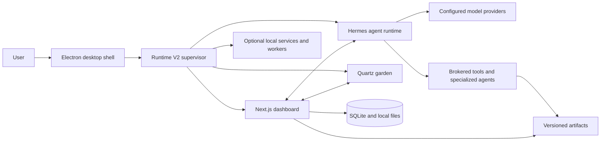

# Breadboard

<p align="center">
  <strong>A local-first AI workbench where knowledge, agents, tools, and creation converge: research deeply, learn from any source, build with specialized agents, and turn ambitious ideas into versioned, publishable work.</strong>
</p>

<p align="center">
  
  
  
  
  
</p>

> [!IMPORTANT]
> Breadboard is an experimental project under active development. It is not a
> stable consumer release yet. Features, data schemas, runtime contracts, setup
> steps, and UI behavior may change without notice. The Windows installer is
> currently unsigned, automatic updates are disabled, and you should keep
> backups of any important workspace data.

## Overview

Breadboard brings research, learning, creation, and agent-assisted work into one
desktop workspace. A **Garden** keeps a topic's source files, generated learning
material, conversations, notes, artifacts, and knowledge graph together.

From the same workspace you can:

- ingest PDFs, Office files, images, archives, audio, video, and Markdown;
- turn source material into structured, cited learning paths;
- chat with a Garden or use the general-purpose AI Terminal;
- delegate work to specialized research, coding, media, office, and CAD agents;
- create and revise versioned documents, presentations, spreadsheets, PDFs,
  HTML pages, visualizations, and media artifacts;
- browse or publish the result through a Quartz-powered digital garden.

Breadboard runs its application services locally and stores mutable workspace
data on the machine. Configured model providers, connected apps, and web tools
can still send the content you ask them to process to their respective services.

## Highlights

| Area | What Breadboard provides |
| --- | --- |
| **Gardens** | Topic-scoped sources, chats, notes, learning maps, links, and Quartz pages. |
| **AI workspace** | A durable Terminal and Garden Chat powered by Hermes, with resumable runs and conversation history. |
| **Learn pipeline** | Source-aware planning, syllabus generation, citations, visuals, validation, repair, and recovery. |
| **Artifacts** | Versioned creation and editing for Markdown, HTML, PDF, Word, PowerPoint, Excel, data, images, audio, and video. |
| **Visual HTML editing** | A sandboxed Vvveb editor for point-and-click changes while preserving artifact history. |
| **Specialized agents** | Research, coding, browser, office, visualization, media, CAD, and other bounded workflows. Availability depends on local setup. |
| **Connected tools** | MCP servers and optional connected apps, scoped through authenticated brokered routes. |
| **Desktop runtime** | An Electron shell with a Rust-based Runtime V2 supervisor for service health, recovery, limits, logging, and shutdown. |

## Development Status

Breadboard is being built in public, but it should currently be treated as an
alpha-quality developer project.

- **Primary target:** Windows 10/11 x64. The installer and full desktop runtime
  are only release-tested on Windows.
- **Packaging:** local Windows installer builds are supported, but the installer
  is unsigned and there is no automatic updater.
- **Compatibility:** migrations and configuration defaults are evolving; review
  changes before opening an existing data directory with a newer revision.
- **Optional capabilities:** many agents require an additional local runtime,
  application, model, account, or setup step. Missing integrations should
  degrade visibly, but not every combination is tested.
- **Deployment:** Ubuntu self-hosting is documented, but the desktop application
  remains the main development path.
- **Data safety:** use a copy of important material and maintain backups. This is
  not yet intended for irreplaceable or regulated data.

Bug reports with reproduction steps, logs, and the commit hash are especially
useful while the project is changing quickly.

## How It Fits Together


```mermaid
flowchart LR
    User[User] --> Desktop[Electron desktop shell]
    Desktop --> Runtime[Runtime V2 supervisor]
    Runtime --> Dashboard[Next.js dashboard]
    Runtime --> Hermes[Hermes agent runtime]
    Runtime --> Quartz[Quartz garden]
    Runtime --> Services[Optional local services and workers]

    Dashboard --> SQLite[(SQLite and local files)]
    Dashboard <--> Hermes
    Dashboard <--> Quartz
    Hermes --> Providers[Configured model providers]
    Hermes --> Tools[Brokered tools and specialized agents]
    Tools --> Artifacts[Versioned artifacts]
    Dashboard --> Artifacts
```

The Electron main process owns application lifecycle. Runtime V2 starts and
monitors the allowed local services and finite jobs. The dashboard handles the
workspace UI, authenticated APIs, persistence, and artifact presentation;
Hermes handles conversational agent work; Quartz renders Gardens.

## Typical Workflow

1. Create a Garden for a topic or project.
2. Add source material such as PDFs, documents, links, audio, or video.
3. Build a learning structure or browse the extracted source tree.
4. Ask questions in Garden Chat, or use the Terminal for work that spans
   Gardens and connected repositories.
5. Open generated artifacts, edit them, ask AI for revisions, and retain earlier
   versions.
6. Explore the knowledge map or view the Garden through Quartz.

## Getting Started

### Prerequisites

The full desktop development stack currently expects:

- Windows 10 or 11 x64;
- Node.js `22.15+`, `23.5+`, or `24+` and npm;
- Python 3.11+ and [`uv`](https://docs.astral.sh/uv/);
- Rust and Cargo;
- Bun 1.3.14+;
- Git.

Docker Desktop, Docker Engine, or Podman is optional and is only needed for
features that depend on containerized services, such as social publishing.
Some media and specialist agents have their own documented prerequisites.

### 1. Clone and install

```powershell
git clone https://github.com/kuzeyatay/breadboard.git
cd breadboard

npm ci
npm ci --prefix dashboard
npm ci --prefix quartz
npm ci --prefix desktop
npm ci --prefix hermes-agent

Push-Location hermes-agent
uv sync
Pop-Location
```

The repository contains several integrated upstream projects. Some optional
capabilities also provision isolated runtimes on first use or through a
dedicated `npm run setup:*` command.

### 2. Configure development secrets

```powershell
Copy-Item .env.example .env
Copy-Item dashboard/.env.example dashboard/.env.local
```

At minimum, replace the placeholder `NEXTAUTH_SECRET` in
`dashboard/.env.local` with a long random value. Review both example files
before starting: they document model providers, local services, connected apps,
paths, and optional capabilities.

Never commit `.env`, `dashboard/.env.local`, OAuth tokens, provider keys, or
generated runtime credentials.

### 3. Run the desktop development stack

```powershell
npm run dev
```

The current root `dev` command starts the integrated Electron application in
dashboard hot-development mode. Runtime V2 owns the local service tree and
reports startup or recovery failures in the app.

Useful alternatives:

| Command | Purpose |
| --- | --- |
| `npm run desktop:dev:hot` | Electron plus the hot Next.js development server. |
| `npm run desktop:dev:lean` | Production-like standalone dashboard with lower long-running compiler overhead. |
| `npm run dev:dashboard` | Dashboard only; other required services must already be available. |
| `npm run dev:quartz` | Quartz Garden only. |
| `npm run dev:chatmock` | Local OpenAI-compatible model bridge only. |
| `npm run dev:hermes` | Hermes runtime only. |

Default manual-development URLs are:

- Dashboard: `http://localhost:3000`
- Quartz: `http://localhost:8081`
- ChatMock API: `http://localhost:8765/v1`
- Hermes: `http://localhost:9129`

Desktop launches use dynamically allocated loopback ports, so these defaults do
not necessarily match an Electron session.

## Building the Windows Installer

```powershell
npm run desktop:build:dashboard
npm run desktop:prepare
npm run desktop:test
npm run desktop:verify
npm run desktop:dist:win
```

The installer is written to the configured desktop release directory. The
default development output is under:

```text
%LOCALAPPDATA%/breadboard-desktop-build/release/
```

Before distributing a build, follow the
[desktop release checklist](docs/DESKTOP_RELEASE_CHECKLIST.md). The current
installer is unsigned and is intended for development and evaluation.

## Testing

The main validation entry points are:

```powershell
npm run test:dashboard
npm run desktop:test
npm run test:scripts
npm run qa:runtime-v2:parity
npm run qa:electron:critical
```

Some suites build native components, launch Electron, or prepare local services.
See the desktop and Runtime V2 documentation before running packaged, burn-in,
or memory QA.

## Repository Layout

```text
breadboard/
|-- dashboard/        Next.js application, APIs, persistence, and UI
|-- desktop/          Electron shell and desktop packaging
|-- native/           Rust Runtime V2 supervisor and shared protocols
|-- runtime-v2/       Runtime manifests and service contracts
|-- hermes-agent/     Conversational agent runtime
|-- hermes-config/    Breadboard agent, system, and tool configuration
|-- chatmock/         Local OpenAI-compatible provider bridge
|-- quartz/           Garden source and generated Quartz site
|-- docs/             Architecture, operations, and integration guides
|-- qa/               Electron, runtime, memory, and packaged-app QA
|-- scripts/          Setup, launch, migration, and validation helpers
`-- shared/           Cross-runtime shared assets and contracts
```

Additional top-level directories are pinned source snapshots of the upstream
projects Breadboard integrates. They are committed as ordinary monorepo files,
not Git submodules, so a normal clone contains the integration source. See the
[source snapshot manifest](docs/VENDORED_REPOSITORIES.md) for revisions,
licenses, deliberate size exclusions, and the refresh procedure.

## Documentation

| Topic | Guide |
| --- | --- |
| Desktop architecture | [docs/DESKTOP_ARCHITECTURE.md](docs/DESKTOP_ARCHITECTURE.md) |
| Desktop development | [docs/DESKTOP_DEVELOPMENT.md](docs/DESKTOP_DEVELOPMENT.md) |
| Packaging and releases | [docs/DESKTOP_PACKAGING.md](docs/DESKTOP_PACKAGING.md) and [docs/DESKTOP_RELEASE_CHECKLIST.md](docs/DESKTOP_RELEASE_CHECKLIST.md) |
| Runtime V2 | [docs/RUNTIME_V2_ARCHITECTURE.md](docs/RUNTIME_V2_ARCHITECTURE.md) |
| Hermes runtime | [docs/HERMES_RUNTIME.md](docs/HERMES_RUNTIME.md) |
| Model providers | [docs/MODEL_PROVIDERS.md](docs/MODEL_PROVIDERS.md) |
| Memory architecture | [docs/MEMORY_ARCHITECTURE.md](docs/MEMORY_ARCHITECTURE.md) |
| Knowledge map | [docs/BRAIN_MAP.md](docs/BRAIN_MAP.md) |
| Interactive visualizations | [docs/INTERACTIVE_VISUALIZER.md](docs/INTERACTIVE_VISUALIZER.md) |
| Adding an agent | [docs/ADDING_AN_AGENT.md](docs/ADDING_AN_AGENT.md) |
| Integrated source snapshots | [docs/VENDORED_REPOSITORIES.md](docs/VENDORED_REPOSITORIES.md) |
| Ubuntu deployment | [DEPLOYMENT-UBUNTU.md](DEPLOYMENT-UBUNTU.md) |

Specialized integrations have their own guides in [`docs/`](docs/), including
Codex, Deep Research, GBrain, GenOffice, UI-TARS, CAD, audio analysis, video
editing, transcription, and connected communication tools.

## Security and Privacy Notes

- Desktop services bind to loopback interfaces and use per-install credentials.
- The renderer receives a narrow preload API rather than filesystem or process
  access.
- Tool calls and connected-app operations pass through authenticated,
  scope-aware server routes.
- Local-first does not mean offline-only: model providers, OAuth-connected apps,
  web research, and publishing integrations can transmit selected content.
- Do not expose development services directly to an untrusted network.
- Review [docs/DESKTOP_SECURITY.md](docs/DESKTOP_SECURITY.md) before packaging or
  deployment.

These controls are still evolving and should not be treated as a completed
security audit.

## Roadmap

Near-term work is focused on:

- making first-run setup and optional runtime provisioning more predictable;
- stabilizing artifact editing and cross-session agent continuity;
- reducing resource use across long-running desktop sessions;
- expanding migration, backup, and recovery coverage;
- improving packaged-app parity and installer trust;
- tightening documentation as integrations mature.

## Why "Breadboard"?

A physical breadboard is where ideas are assembled, tested, rearranged, and
turned into working systems. This project applies the same idea to knowledge:
bring the raw material together, connect it, experiment with it, and keep the
result open to revision.
