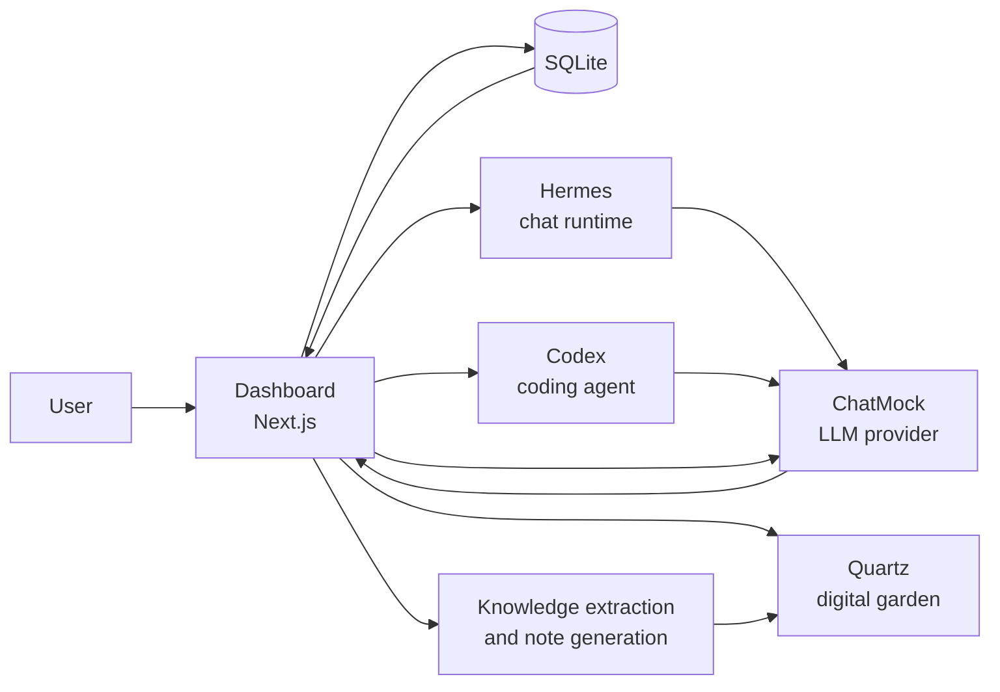

# Breadboard

<p align="center">
  <strong>A cluster-based second brain for ingesting documents, chatting with knowledge, and publishing a digital garden.</strong>
</p>

<p align="center">
  
  
  
  
  
  
</p>

---

## What is Breadboard?
>i promise its not a virus

**Breadboard** is a multi-service knowledge workspace built around a simple idea:

> turn raw material into structured knowledge, then make it explorable.

It combines:

- a **private dashboard** for managing clusters
- a **local AI bridge** for model access
- a **knowledge ingestion pipeline** for uploaded sources
- a **Quartz-powered digital garden** for browsing and publishing notes

Each **cluster** acts like its own knowledge environment. You can upload source material, extract text, generate notes, chat against the cluster’s knowledge graph, and view the result as a browsable garden.

---

## Core Features

### Cluster-Based Knowledge Spaces
- Create separate knowledge gardens for different topics or projects
- Organize sources, notes, chats, and graph relationships per cluster
- Support for **private** and **public** clusters

### Invite-Only Accounts
- Credentials-based authentication
- Invite-code registration flow
- SQLite-backed user and session-related data

### AI-Assisted Workflows
- Chat inside a cluster using grounded cluster context
- Generate notes from conversations
- Extract structured knowledge from uploaded material
- Pull available models from a local OpenAI-compatible backend

### Document Ingestion
- PDF ingestion
- Image transcription
- DOCX text extraction
- PPTX text extraction
- XLSX text extraction
- ZIP archive text extraction
- Markdown generation from extracted content

### Knowledge Graph + Garden
- Knowledge map with documents, topics, notes, and links
- Source tree view inside the dashboard
- Quartz-powered library and garden views
- Cluster-specific garden pages
- Public library mode

### Local Workflow
- Windows-friendly launcher included
- ChatMock, Quartz, and the dashboard can be run together locally
- SQLite storage keeps setup lightweight

---

## Desktop App (Windows)

Breadboard ships as a native Windows desktop application: an Electron shell
that starts, supervises, and cleanly shuts down the whole local stack
(ChatMock + Hermes + Postiz + Quartz → dashboard) with no terminal windows and no
manual `start.bat` or localhost URLs.

- **Develop**: `npm ci --prefix desktop`, then `npm run desktop:dev` from
  the repo root (uses the normal dev servers; existing scripts unchanged).
- **Build the installer**: `npm run desktop:build:dashboard` →
  `npm run desktop:prepare` → `npm run desktop:test` →
  `npm run desktop:verify` → `npm run desktop:dist:win`
  (produces `%LOCALAPPDATA%/breadboard-desktop-build/release/Breadboard-Setup-<version>-x64.exe`).
- **Installed smoke test**: `npm run desktop:smoke:installed -- "<installer.exe>"`
  installs the NSIS artifact, drives the installed stack with isolated data,
  verifies restart/persistence/process cleanup, uninstalls it, and restores a
  pre-existing per-user installation if one was present.
- **Runtime architecture**: the Electron main process is the lifecycle owner;
  services run on bundled Node/Bun/Python runtimes, bind `127.0.0.1` only,
  and use per-launch ports and per-install secrets. See
  `docs/DESKTOP_ARCHITECTURE.md`.
- **Data**: everything mutable lives in `%APPDATA%/breadboard-desktop/Data/`
  (databases, gardens, config, `logs/`). The installer never touches it; an
  existing dev checkout's data can be imported (copied) on first launch —
  see `docs/DESKTOP_ARCHITECTURE.md` (migration) and
  `docs/DESKTOP_TROUBLESHOOTING.md`.
- **Required desktop dependency**: Docker Desktop, Docker Engine, or Podman is
  required for Postiz social publishing. Desktop startup waits for Postiz's
  authenticated API and shows a visible failure with `postiz.log` if it cannot
  become ready. ffmpeg/yt-dlp remain optional for video ingestion.
- **Signing / updates**: the installer is currently unsigned and auto-update
  is disabled by design — see `docs/DESKTOP_RELEASE_CHECKLIST.md`.

Full docs: `docs/DESKTOP_ARCHITECTURE.md`, `docs/DESKTOP_RUNTIME_AUDIT.md`,
`docs/DESKTOP_DEVELOPMENT.md`, `docs/DESKTOP_PACKAGING.md`,
`docs/DESKTOP_SECURITY.md`, `docs/DESKTOP_TROUBLESHOOTING.md`,
`docs/DESKTOP_RELEASE_CHECKLIST.md`,
`docs/DESKTOP_IMPLEMENTATION_REPORT_2026-07-21.md`.

---

## Architecture


```mermaid
flowchart LR
    U[User] --> D[Dashboard<br/>Next.js]
    D --> DB[(SQLite)]
    D --> H[Hermes<br/>chat runtime]
    H --> CM[ChatMock<br/>LLM provider]
    D --> C[Codex<br/>coding agent]
    C --> CM
    D --> CM
    D --> Q[Quartz<br/>digital garden]
    D --> KG[Knowledge extraction<br/>and note generation]

    KG --> Q
    DB --> D
    CM --> D
```

---

## Repository Structure

```text
breadboard/
├── chatmock/      # local OpenAI-compatible model bridge
├── dashboard/     # main app (Next.js + auth + APIs + UI)
├── pdf.js/        # PDF-related frontend/runtime assets
├── quartz/        # Quartz site used as the garden layer
├── scripts/       # helper scripts, including Quartz startup
└── start.bat      # starts ChatMock, Quartz, and Dashboard
```

---

## Tech Stack

### Frontend
- Next.js
- React
- TypeScript
- Tailwind CSS
- KaTeX + markdown rendering

### Backend / App Layer
- Next.js route handlers
- NextAuth credentials authentication
- better-sqlite3

### AI / Knowledge Layer
- OpenAI SDK pointed at a configurable backend
- ChatMock for local OpenAI-compatible responses
- Knowledge extraction and note generation flows
- **GBrain** — optional garden-scoped knowledge retrieval (hybrid search,
  multi-source synthesis, citations) behind a first-party loopback adapter,
  enabled only for authenticated Garden Chat and Terminal. It never replaces
  conversation memory and all writes stay proposal-based. Off by default
  (`GBRAIN_MODE=disabled`); see [docs/GBRAIN_INTEGRATION.md](docs/GBRAIN_INTEGRATION.md).

### Garden / Publishing
- Quartz v4.5.2

---

## How Breadboard Works

### 1. Create an Account
Breadboard uses an invite-code-based signup flow, then signs users in with credentials.

### 2. Create a Cluster
A cluster is your workspace. It groups source material, notes, chats, and garden content together.

### 3. Upload Source Material
You can ingest documents and other files into a cluster, extract readable text, and convert that into markdown.

### 4. Generate Structure
Breadboard turns source material into:
- source documents
- extracted topics
- related notes
- graph relationships

### 5. Chat with the Cluster
Cluster chat is grounded in the cluster’s stored knowledge, including notes, extracted topics, and graph relationships.

### 6. Save Durable Notes
You can generate notes from chats or write markdown notes manually.

### 7. Browse the Garden
Quartz renders the resulting knowledge as a browsable digital garden, with private and public views.

---

## Database Model at a Glance

The SQLite database stores:

- `users`
- `invite_codes`
- `clusters`
- `chat_sessions`
- `chat_messages`
- `pdf_document_edits`
- `pdf_document_edit_history`

That means Breadboard is not only storing notes and clusters, but also preserving chat history and PDF edit history.

---

## Included Routes and Capabilities

The dashboard exposes route groups for workflows such as:

- auth
- registration
- models
- chat
- chat sessions
- clusters
- documents
- extract-text
- ingest
- generate-notes
- invites
- knowledge-graph
- Quartz graph preview
- PDF.js passthrough

This makes the dashboard the orchestration layer for the whole workspace.

---

## Local Development

### Prerequisites

- **Node.js 22+**
- **npm**
- **Python 3.11+**
- Windows PowerShell if you want to use the included startup script flow directly

### 1. Clone the Repository

```bash
git clone https://github.com/kuzeyatay/breadboard.git
cd breadboard
```

### 2. Install Dependencies

#### Dashboard
```bash
cd dashboard
npm install
cd ..
```

#### Quartz
```bash
cd quartz
npm install
cd ..
```

#### ChatMock
Using a virtual environment:

```bash
cd chatmock
python -m venv .venv
```

Activate it:

**Windows**
```bash
.venv\Scripts\activate
```

**macOS / Linux**
```bash
source .venv/bin/activate
```

Then install:

```bash
pip install -e .
cd ..
```

### 3. Configure Environment Variables

Create:

```text
dashboard/.env.local
```

Suggested starting point:

```env
NEXTAUTH_SECRET=replace-this-with-a-long-random-secret
NEXTAUTH_URL=http://localhost:3000

OPENAI_BASE_URL=http://localhost:8765/v1
QUARTZ_CONTENT_PATH=../quartz/content

SECOND_BRAIN_INITIAL_INVITE_CODE=YOURINVITECODE
```

You may also need to add any backend-specific variables your local model bridge expects.

#### Learn generation token limits (optional)

The Learn pipeline uses token-efficient defaults: planning (source map, scope
contract, topic map) runs on `full_council`, while subsection writing and
repair run on `direct_council` with a compact per-page dossier. These are the
defaults — set the variables only to change them:

```env
LEARN_GENERATION_COUNCIL_MODE=direct_council
LEARN_REVISION_COUNCIL_MODE=direct_council
LEARN_MAX_PAGE_ATTEMPTS=1
LEARN_MAX_SNIPPETS_PER_PAGE=5
LEARN_MAX_CHARS_PER_SNIPPET=1200
LEARN_MAX_TOTAL_SOURCE_CHARS_PER_PAGE=6000
LEARN_MAX_VISUALS_PER_PAGE=3
LEARN_ENABLE_UNCONDITIONAL_REVISION=false
LEARN_LOG_PROMPT_BUDGET=true
```

`LEARN_MAX_PAGE_ATTEMPTS` is clamped to at most 2. A page that fails the
deterministic quality gate gets one focused repair call, never repeated
full regeneration. `LEARN_LOG_PROMPT_BUDGET` prints a
`[learn-token-budget]` line with approximate input tokens before every
ChatMock call.

### 4. Start the App

#### Easiest Route on Windows

From the repo root:

```bat
start.bat
```

This starts:
- **ChatMock** on port `8765`
- **Scriberr** on port `8091` (video transcription service; requires Docker)
- **Quartz** on port `8081`
- **Hermes** on port `9129` (interactive chat runtime)
- **Dashboard** on port `3000`

> **Hermes remains the conversational runtime.** Codex is a separate coding
> agent in the composer’s **Agents** tab, alongside OpenCode. It runs only when
> `/agents:codex` is selected, works in a Garden-connected repository, and uses
> ChatMock's Responses API. See [docs/CODEX_INTEGRATION.md](docs/CODEX_INTEGRATION.md).
>
> **HyperFrames** makes videos. `/agents:hyperframes <brief>` scaffolds a
> HyperFrames project, has a Codex process write the composition against the
> clone's own video skills, renders an MP4 with the local CLI + FFmpeg, and
> plays it in the chat card. The framework is vendored at `./hyperframes`. See
> [docs/HYPERFRAMES_INTEGRATION.md](docs/HYPERFRAMES_INTEGRATION.md).
>
> **Resource2Skill** builds polished artifacts from Microsoft’s distilled
> multimodal skill libraries. `/agents:resource2skill <brief>` routes to Web,
> PowerPoint, Excel, Blender, or audio automatically; add `--domain <name>` to
> choose explicitly. Provision its isolated Python 3.11 environment with
> `npm run setup:resource2skill`. See
> [docs/RESOURCE2SKILL_INTEGRATION.md](docs/RESOURCE2SKILL_INTEGRATION.md).
>
> **ViMax** makes films. `/agents:vimax <idea>` writes the story and screenplay,
> casts and draws the characters, storyboards every shot, decomposes each shot
> into first frame, motion and last frame, and ends in one artifact that plays
> back as an animatic. The pipeline is ported from the clone at `./vimax` and
> runs on ChatMock — no image or video API key needed. See
> [docs/VIMAX_INTEGRATION.md](docs/VIMAX_INTEGRATION.md).
>
> **Video Use** edits videos you already have. Attach one — or paste a YouTube
> link, which is downloaded once and reused for every later mention — to a chat
> message that asks for it to be changed ("cut the dead air", "trim it to 60
> seconds", "make it vertical") and the edit runs without selecting an agent
> first. Ask a question about the same link instead and the Watch skill answers
> it from the same downloaded copy. The
> result is a video artifact, and opening it opens a studio where further
> prompts keep changing the same video: every pass replays the whole edit
> against the untouched original, so revisions never stack up as re-encodes and
> any earlier version can be restored. The studio opens for *any* video
> artifact, whichever agent made it. The clone is at `./video-use` and needs no
> environment built; an optional ElevenLabs key adds filler-word cuts and burned
> captions. See [docs/VIDEO_USE_INTEGRATION.md](docs/VIDEO_USE_INTEGRATION.md).
>
> **Scriberr** powers Garden Chat's video import: upload a video or paste a
> YouTube URL and the full transcript becomes a timestamped Markdown source
> under the garden's `sources/` folder. Scriberr is vendored at `./scriberr`
> and runs via Docker (`npm run dev:scriberr`); set `SCRIBERR_AUTOSTART=false`
> to skip it. See [docs/VIDEO_TRANSCRIPTION.md](docs/VIDEO_TRANSCRIPTION.md)
> for setup, environment variables, and troubleshooting.
>
> **Audio analysis** gives Breadboard ears. Attach a song to any chat and ask
> about it — key, tempo, LUFS loudness, dynamic range, frequency balance, stereo
> field, section boundaries, or how your mix differs from a reference — and the
> answer is measured from the waveform rather than recalled about the song. It
> runs on the pure-Rust `audio-analyzer-rs` clone (no Python, no ffmpeg, nothing
> uploaded); provision it once with `npm run setup:audio-analyzer`. See
> [docs/AUDIO_ANALYSIS.md](docs/AUDIO_ANALYSIS.md).

#### Manual Startup

##### ChatMock
```bash
cd chatmock
python chatmock.py serve --port 8765 --reasoning-effort low --reasoning-summary detailed --reasoning-compat legacy
```

##### Quartz
```powershell
powershell -NoExit -NoProfile -ExecutionPolicy Bypass -File .\scripts\start-quartz.ps1
```

##### Dashboard
```bash
cd dashboard
npm run dev
```

---

## Local URLs

- Dashboard: `http://localhost:3000`
- Quartz garden: `http://localhost:8081`
- ChatMock backend: `http://localhost:8765/v1`
- Scriberr (video transcription): `http://localhost:8091`
- PenEcho (whiteboard cards): `http://localhost:8092` (started on demand)

---

## Notable Implementation Details

- The dashboard homepage redirects to `/dashboard`
- The Quartz site is configured with the title **breadboard**
- Quartz is configured with SPA navigation and popovers enabled
- Public and private garden/library views are both supported
- Cluster chat is grounded using cluster knowledge inventory and graph relationships
- New markdown notes can be created from the UI
- The knowledge map tracks sources, topics, notes, links, and word counts

---

## Why the Name?

A breadboard is where ideas get tested, rearranged, and turned into working systems.

This project applies that same philosophy to knowledge: raw information goes in, structure emerges, and the result becomes something you can inspect, evolve, and publish.

---

## Roadmap Ideas

- one-command setup for all services
- Dockerized local development
- cleaner environment configuration
- deployment guide for the dashboard + Quartz pair
- better onboarding for first-time users
- cluster templates
- import/export flows

## Deploying on Ubuntu

For a small self-hosted machine, including a home server or old Mac mini running Ubuntu, see:

- [DEPLOYMENT-UBUNTU.md](DEPLOYMENT-UBUNTU.md)

---


## Summary

**Breadboard is a cluster-based second brain that lets you ingest documents, extract structured knowledge, chat against that knowledge, and publish the result as a digital garden.**
