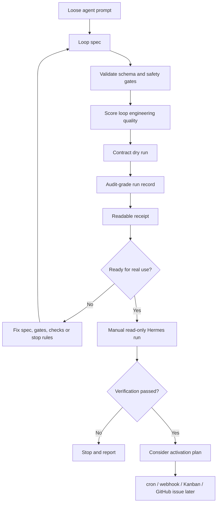
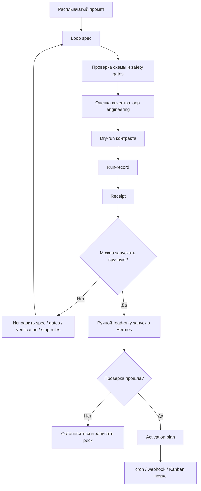

# Agent Loop Engineering Kit

<p align="center">
  
</p>

<p align="center">
  <strong>Design, validate, dry-run and audit safe Hermes Agent loop contracts before you automate them.</strong>
</p>

<p align="center">
  <code>build loops</code> · <code>verify reality</code> · <code>stop safely</code>
</p>

<p align="center">
  <a href="https://youtube.com/@alekseiulianov">YouTube</a> ·
  <a href="https://t.me/Sprut_AI">Telegram channel</a> ·
  <a href="https://t.me/+eH-qNIDmud8zNDZi">Telegram chat</a> ·
  <a href="https://t.me/tribute/app?startapp=sJyg">AI Операционка</a>
</p>

---

## What this is

**Agent Loop Engineering Kit** is a safety-first toolkit for people building repeatable workflows on top of [Hermes Agent](https://github.com/NousResearch/hermes-agent).

It helps you turn a loose agent prompt like:

```text
Every morning, make me a briefing.
```

into a bounded, inspectable loop with:

- explicit trigger;
- inputs and state;
- allowed tools;
- forbidden actions;
- risk class;
- deterministic checks;
- human gates;
- stop conditions;
- audit-grade receipt.

The point is simple: **do not automate a vague prompt**. First design the loop. Then verify the contract. Then dry-run. Only after that think about cron, webhook, Kanban or GitHub automation.

## What this is not

It is **not a replacement for Hermes**.

It does **not**:

- execute real agent tasks;
- create or modify Hermes cron/webhook/Kanban jobs;
- write to Hermes profiles, memory, skills or cron config;
- replace Hermes runtime, scheduler or gateway;
- prove that a model answer is true;
- make unattended automation safe by itself.

`v0.1` is a **design + validation + dry-run + receipt + privacy scan** kit.

---

## How it works



Core rule:

> A loop is not done because an agent says it is done. It is done when verification passes, the stop reason is recorded, and the receipt is readable.

---

## Install

Prerequisites: Python 3.11+ and either `uv` or `pipx`.

Recommended:

```bash
uv tool install https://github.com/AlekseiUL/agent-loop-engineering-kit.git
```

If you do not have `uv`, install it from <https://docs.astral.sh/uv/> or use `pipx`:

```bash
pipx install git+https://github.com/AlekseiUL/agent-loop-engineering-kit.git
```

For v0.1 this is a GitHub install. PyPI publishing is a later packaging step.

From a local checkout:

```bash
uv tool install .
```

Check:

```bash
hermes-loop --help
```

---

## 10-minute golden path

Create a loop spec:

```bash
hermes-loop init /tmp/my-loop.yaml
```

Validate the contract:

```bash
hermes-loop validate /tmp/my-loop.yaml
```

Score whether it is actually loop-engineered:

```bash
hermes-loop score /tmp/my-loop.yaml
```

Create a dry-run record and receipt:

```bash
hermes-loop dry-run /tmp/my-loop.yaml --out /tmp/my-loop-run
```

Render the receipt:

```bash
hermes-loop render-receipt /tmp/my-loop-run/run-record.yaml > /tmp/my-loop-run/receipt.rendered.md
```

Scan for common leaks before publishing artifacts:

```bash
hermes-loop privacy-scan .
```

Expected result: a validated spec, a quality score, a dry-run run-record, and an audit receipt. The dry run does **not** execute the real agent task.

## After dry-run: manual Hermes run

After the contract dry-run passes, run the first real attempt manually in Hermes. Keep it read-only until the receipt proves the process is bounded.

```text
Use this loop spec as the contract for one manual read-only run.
Do not create cron/webhook/Kanban jobs.
Do not write to Hermes memory, skills, cron or config.
Return: inputs used, tools/actions taken, verification output, stop reason, unresolved risks and receipt path.

<attach or paste loop-spec.yaml>
```

Only after a clean manual run should you fill `templates/hermes-activation-plan.md` and consider cron/webhook/Kanban.

Example receipt shape:

```text
# Loop Run Receipt
- Loop: `example-loop`
- Status: `DRY_RUN`
- Verification: PASS
- Stop reason: contract dry run completed
- External side effects: none
```

---

## CLI

```bash
hermes-loop init <path>
hermes-loop validate <loop-spec.yaml>
hermes-loop score <loop-spec.yaml>
hermes-loop dry-run <loop-spec.yaml> --out <dir>
hermes-loop render-receipt <run-record.yaml>
hermes-loop privacy-scan <path>
hermes-loop smoke
```

`hermes-loop smoke` is for repository checkouts. It expects `examples/` and `tests/` to exist.

---

## Example: prompt-only vs engineered loop

A loose prompt scores badly because it has no gates, state, verification or stop conditions:

```text
7/100 not_loop_engineered  examples/emulation-prompt-only.yaml
```

A properly engineered Hermes loop spec scores as ready for dry-run/manual use:

```text
100/100 ready  examples/hermes-cron-daily-briefing-loop/loop-spec.yaml
```

There is also a deliberately unsafe example:

```text
examples/bad-cron-repo-editor/loop-spec.yaml
```

It fails because cron-triggered L3 repo editing without deterministic checks and isolation should not pass.

---

## Risk classes

| Class | Meaning | Default mode |
|---|---|---|
| L0 | Advisory / read-only one-off | Direct task |
| L1 | Repeated read-only report | Dry-run, then manual active run |
| L2 | Writes local reports/state only | Active with receipts |
| L3 | Edits repo/files | Worktree + tests + reviewer |
| L4 | External side effects | Approval every run |
| L5 | Money, secrets, deletion, legal/finance/prod | Blocked unless explicit approval and rollback |

---

## Hermes mapping

| Loop component | Hermes shape |
|---|---|
| Trigger | manual chat, cronjob, webhook, Kanban card, GitHub issue |
| Context/state | profile role, skills, memory, files, AGENTS.md, session search |
| Agent run | Hermes profile / worker |
| State | files, reports, receipts, Kanban, GitHub issues |
| Isolation | read-only, temp workspace, git worktree, profile boundary |
| Verification | tests, lint, smoke checks, reviewer, human review |
| Human gate | approval before posting, billing, secrets, production, deletion |

Default rule: no cross-profile access and no writes to Hermes memory, skills, cron, plugins, config or auth unless an activation plan explicitly allows it and a human approves it.

---

## Useful links

- [YouTube: Aleksei Ulianov — AI agents](https://youtube.com/@alekseiulianov)
- [Telegram channel: Sprut AI](https://t.me/Sprut_AI)
- [Telegram chat: Sprut AI](https://t.me/+eH-qNIDmud8zNDZi)
- [AI Операционка](https://t.me/tribute/app?startapp=sJyg)
- [Hermes Agent](https://github.com/NousResearch/hermes-agent)

---

## Repository contents

| Path | Purpose |
|---|---|
| `hermes_loop/` | Installable CLI package |
| `schemas/` | Loop spec and run-record schemas |
| `templates/` | Loop spec, activation plan, receipt and policy templates |
| `examples/` | Good examples, bad examples and Hermes cron promotion example |
| `docs/07-hermes-lifecycle.md` | Prompt → spec → dry-run → manual run → activation path |
| `docs/08-threat-model.md` | Threat model for Hermes loops |
| `scripts/` | Source-tree scripts and release smoke checks |
| `tests/` | Pytest regression suite |

---

## Release contract

- Loop spec schema version: `1.0`.
- Run-record / receipt contract: v1.
- v0.1 intends compatibility for these contracts.
- Breaking changes should wait for v0.2+ and be documented in `CHANGELOG.md`.

Before publishing or tagging a release:

```bash
hermes-loop smoke
hermes-loop privacy-scan .
bash scripts/installed_cli_smoke.sh
```

Manual checks:

- no `build/`, `dist/`, `*.egg-info`, `__pycache__/` or `.pytest_cache/` artifacts;
- no API keys, tokens, cookies, private chats or customer data;
- no private local paths in public examples or receipts;
- examples still show manual/read-only first and cron/webhook/Kanban later.

---

# Русская версия

## Что это

**Agent Loop Engineering Kit** — это набор инструментов для людей, которые строят повторяемые агентские процессы на базе Hermes Agent.

Он помогает превратить расплывчатый промпт в нормальный инженерный loop:

```text
триггер → контекст/состояние → агент/инструменты → наблюдение → проверка → обновление состояния → стоп/повтор/эскалация → receipt
```

Главная идея: **не автоматизировать хаос**.

Сначала описываем loop. Потом проверяем границы. Потом делаем dry-run. Потом получаем receipt. И только после этого думаем про cron, webhook, Kanban или GitHub issue.

## Что он даёт

- `hermes-loop init` — создать шаблон loop spec;
- `hermes-loop validate` — проверить схему и safety gates;
- `hermes-loop score` — понять, это реально loop engineering или просто красивый YAML;
- `hermes-loop dry-run` — создать dry-run run-record и receipt;
- `hermes-loop render-receipt` — собрать читаемый audit receipt;
- `hermes-loop privacy-scan` — поймать частые утечки секретов/приватных путей;
- `hermes-loop smoke` — прогнать проверку репозитория.

## Что он не делает

Это **не замена Hermes** и не новый runtime.

Он не запускает реальные агентские задачи, не создаёт cron jobs, не пишет в profiles/memory/skills/cron и не делает one-click automation.

Это намеренно. Для v0.1 задача другая: дать безопасный предохранитель перед автоматизацией.

## Наглядная схема



## Почему это полезно

Обычный агентский процесс часто ломается не из-за модели, а из-за отсутствия инженерной рамки:

- непонятно, когда остановиться;
- нет проверки результата;
- нет границ инструментов;
- нет receipt;
- непонятно, кто разрешил опасное действие;
- cron включили раньше, чем поняли риски.

Этот kit заставляет описать всё это заранее.

Сухой критерий:

> Если loop нельзя проверить, остановить и расследовать по receipt — его рано автоматизировать.

## Полезные ссылки

- [YouTube: Алексей Ульянов — AI-агенты](https://youtube.com/@alekseiulianov)
- [Telegram-канал Sprut AI](https://t.me/Sprut_AI)
- [Telegram-чат Sprut AI](https://t.me/+eH-qNIDmud8zNDZi)
- [AI Операционка](https://t.me/tribute/app?startapp=sJyg)
- [Hermes Agent](https://github.com/NousResearch/hermes-agent)

## Статус

`public v0.1` — готов как design / validation / dry-run / audit kit для Hermes loops.

Не full automation platform. Это следующий слой, не этот релиз.

## Roadmap

v0.2:

- stronger policy validator;
- template packs;
- receipt history / diff;
- machine-readable audit report;
- Hermes activation recipes.

v0.3+:

- gated Hermes integration layer;
- CI policy gate;
- local run registry;
- advanced threat checks;
- controlled read-only execution adapters.

---

## License

MIT
