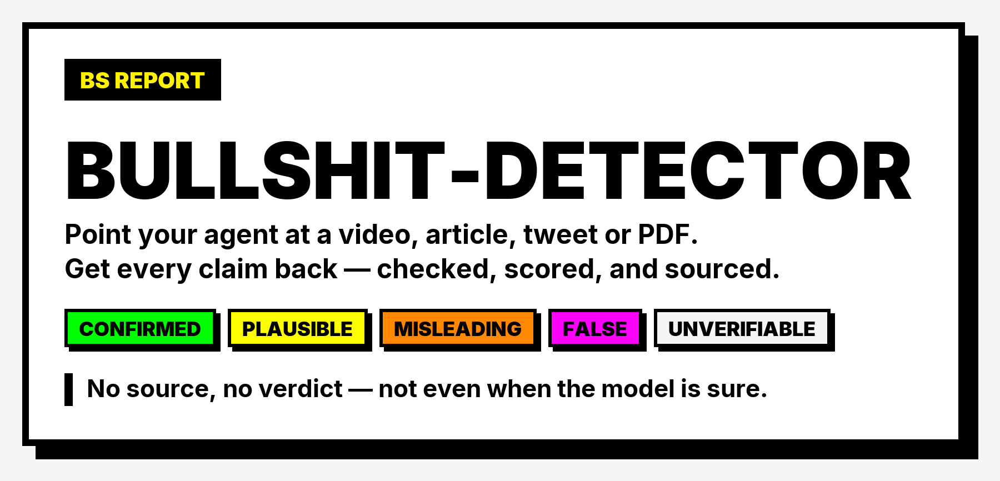

# Bullshit Detector

[](https://skills.sh/SerhiiKorniienko/bullshit-detector)
[](./LICENSE)
[](https://github.com/SerhiiKorniienko/bullshit-detector/actions/workflows/checks.yml)

<a href="https://tinylaunch.com"></a>

<picture>
  <source media="(prefers-color-scheme: dark)" srcset="./assets/banner-dark.png">
  
</picture>

**[Read a real report →](https://serhiikorniienko.github.io/bullshit-detector/examples/0.13.0/report-south-korea-ai-bubble.html)** — 60 claims from a 2.7M-view "the AI bubble is popping" video, 44 of them individually searched, every verdict linked.

Agent skills that fact-check the internet. Point your agent at a viral YouTube video, article, tweet, or PDF — get a claim-by-claim verification report with sources and a **BS score (0–10)** instead of taking "10 WAYS TO MAKE MONEY WITH AI 🤯" at face value.

Portable [Agent Skills](https://agentskills.io) — plain markdown + self-contained Python. They work in Claude Code, Codex, OpenCode, and any harness that supports the skills format and has web search.

Built in the open with [Claude Code](https://claude.com/claude-code) — an AI helped build the tool that fact-checks AI hype, and the [example report](./examples/0.4.x/report-14-ways-to-make-money-with-ai.md) is it auditing its own kind.

Follow [@SerhiiFounder](https://x.com/SerhiiFounder) for new skills and fact-check experiments, or [join the newsletter](https://korniienko.dev/newsletter) to get them in your inbox.

## Quickstart

1. Install [uv](https://docs.astral.sh/uv/) if you don't have it (the fetch script uses it to self-resolve its dependencies).

2. Run the skills.sh installer and pick the skills and agents you want:

```bash
npx skills@latest add SerhiiKorniienko/bullshit-detector
```

3. Ask your agent: *"is this bullshit? \<url\>"*, *"fact-check this video"*, *"summarize \<url\>"*, *"explain the part at 12:30"*.

## Install as a Claude Code plugin

Prefer a managed bundle that updates when a new version ships, instead of copied files you maintain yourself? Inside Claude Code:

```
/plugin marketplace add SerhiiKorniienko/bullshit-detector
/plugin install bullshit-detector@serhii-korniienko
```

Two ways to install, two philosophies:

- **[skills.sh](https://skills.sh/SerhiiKorniienko/bullshit-detector)** copies the skills into your setup so you can hack on them and make them your own. Works with any agent (Claude Code, Codex, OpenCode, …).
- **The plugin** keeps them as a read-only, always-current bundle — best when you just want it to work and follow along as it evolves. Claude Code only.

**Pick one, not both** — installing both gives Claude Code two copies of every skill.

## Setup by agent

Works beyond Claude Code — the skills are plain markdown + self-contained scripts. Full walkthroughs with caveats per surface live in **[SETUP.md](./SETUP.md)**:

| Agent / app | Support | Guide |
|---|---|---|
| Claude Code CLI | ✅ everything | [SETUP.md → Claude Code CLI](./SETUP.md#claude-code-cli) |
| Claude Desktop app (Code tab) | ✅ everything — same as CLI | [SETUP.md → Code tab](./SETUP.md#claude-desktop-app-code-tab) |
| Claude Desktop / claude.ai (Chat) | ⚠️ analysis skills only (sandbox can't reach YouTube/TikTok) | [SETUP.md → Chat](./SETUP.md#claude-desktop-and-claudeai-chat) |
| OpenAI Codex | ✅ via skills.sh installer | [SETUP.md → OpenAI Codex](./SETUP.md#openai-codex) |
| ChatGPT | ⚠️ paste-driven workaround | [SETUP.md → ChatGPT](./SETUP.md#chatgpt) |
| OpenCode, Cursor, Gemini CLI, … | ✅ via skills.sh installer | [SETUP.md → Other agents](./SETUP.md#other-agents) |

## Why These Skills Exist

### #1: Viral ≠ true

A finance guy with 1M views tells you the "only 14 ways to make money with AI". How much of it is real? Views, production value, and confidence are not evidence. The fix is boring: extract every claim, check each against independent sources, and score what survives. That's exactly the work agents with web search are good at and humans never bother doing.

**The fix:** [`bullshit-detector`](./skills/analysis/bullshit-detector/SKILL.md) — per-claim verdicts (✅ confirmed / 🟡 plausible / 🟠 misleading / ❌ false / ❓ unverifiable), a hype-signal scan, an incentive analysis ("who benefits if you believe this"), and a 0–10 BS score. Verdicts require sources — the skill forbids confirming or refuting from model memory alone.

### #2: Agents can't watch videos

Your agent can't sit through a 27-minute video, and YouTube's official API won't give you captions for videos you don't own. Same story with tweets, where the official API now bills per post, and with paywalled articles.

**The fix:** [`fetch-content`](./skills/ingestion/fetch-content/SKILL.md) — one script that turns any URL into clean text + metadata with no API keys: YouTube transcripts and TikTok captions via yt-dlp, articles via readability extraction, PDFs, tweets via free endpoints. Every failure mode produces an actionable hint (paywall → paste, no captions → Whisper) instead of a silent guess.

### #3: Separation of fetching and judging

Ingestion and analysis are different jobs. Scripts do the deterministic work (fetch, parse, normalize); the agent does the reasoning (extract claims, search, judge). Because analysis skills only ever see normalized text + metadata, adding TikTok support one day touches zero analysis logic — and the same detector works on a tweet and a 3-hour podcast.

## Example

A real run against a 1.16M-view "make money with AI" video: **[examples/0.4.x/report-14-ways-to-make-money-with-ai.md](./examples/0.4.x/report-14-ways-to-make-money-with-ai.md)**.

> **BS score: 5/10 — real tools, real trends, guru math, and a funnel every four minutes.**
> 12 claims verified: 4 confirmed, 2 plausible, 3 misleading, 0 false, 3 unverifiable. Among the catches: "Renaissance, D.E. Shaw, Two Sigma only trade employees' money" (true for one fund of one firm), and marketplace stats sourced from the marketplace's own PR.

And a TikTok run — a 552K-view "our Sun has a hidden twin" video: **[examples/0.4.x/report-second-sun-binary-star.md](./examples/0.4.x/report-second-sun-binary-star.md)** (BS score: 9/10 — real astronomy vocabulary stitched onto a fabricated cosmology).

A 137K-view "$1M YouTube channel in 1 hour a day" video — **[examples/0.5.0/report-1m-youtube-channel.md](./examples/0.5.0/report-1m-youtube-channel.md)** (BS score: 7/10). The advice is fine and unremarkable; the headline "$76,000 per video" turns out to be total business revenue divided by videos published. Every proof point is a number only the seller can see, which the report says plainly rather than pretending to have audited it.

And the awkward one: a 43K-view video arguing the AI buildout is about to collapse, checked by a tool built with Claude — **[examples/0.5.0/report-claude-situation-shitshow.md](./examples/0.5.0/report-claude-situation-shitshow.md)** (BS score: 5/10). The reporting holds up; the arithmetic behind its headline number is roughly double reality. The claim it rates ❌ false is also the one most favourable to Anthropic, so the report carries a conflict-of-interest disclosure and links every source to check it against.

Someone on Hacker News asked for the obvious test — run it on this README. **[examples/0.4.x/report-own-readme.md](./examples/0.4.x/report-own-readme.md)** (BS score: 3/10). It caught a two-year-stale API price and a "30-second setup" that began with installing a package manager, both fixed in v0.4.2, and one thing that can't be fixed by editing: the only evidence this tool is accurate is reports it wrote about videos its author picked.

## Check your own draft before you publish

The detector runs on any text, including yours. Point it at a post, README, or launch announcement
you're about to ship — *"fact-check my draft"* — and it flags the claims a hostile reader would go
after first, with the source that fixes each one. Cheaper than a correction.

That's how [examples/0.4.x/report-own-readme.md](./examples/0.4.x/report-own-readme.md) exists: someone on
Hacker News asked for it live, and it found a two-year-stale API price before more people did.

## What it doesn't do

Honest limits, because a tool like this earns nothing by overselling itself:

- **It checks premises, not reasoning.** Every claim can verify clean and the conclusion still not
  follow. A false fact gets caught; a bad inference drawn from true facts sails straight through.
  If you want the argument audited rather than the facts, this is the wrong tool.
- **It can only cite what it can reach.** Many high-reputation outlets block agent crawlers
  entirely, so they never appear in results — and SEO content marketing ranks in the gap. Their
  reporting sometimes re-enters quoted secondhand by an aggregator, which looks like an independent
  source and isn't. [The measurements are here](./experiments/2026-07-30-credible-sources.md); it's
  worse than I assumed before running them.
- **It has no eval harness yet.** So there is no number for how often it's right. The only evidence
  of accuracy is reports it wrote about content its author chose — which is exactly the circularity
  its own [self-audit](./examples/0.4.x/report-own-readme.md) flagged and editing can't fix. Tracked as
  [#3](https://github.com/SerhiiKorniienko/bullshit-detector/issues/3), and it's the top of the backlog.
- **Verdicts vary between runs.** Web search is non-deterministic; the same query minutes apart can
  return a mostly different evidence base. Treat a single report as one reading, not a measurement.

## Experiments

Tests of the detector's own behaviour, published whichever way they land — see
**[experiments/](./experiments/README.md)**. Most recent: [does telling it to "use credible sources"
help?](./experiments/2026-07-30-credible-sources.md) (asked for on Hacker News; the answer is "I
can't tell yet, and here's the more interesting thing I hit instead").

## TikTok videos

Yes, TikTok works — ask the same way: *"is this bullshit? https://vt.tiktok.com/…"*.

How it works under the hood:

1. **Built-in captions first.** Most TikToks ship with creator or auto-generated captions. The [`fetch-content`](./skills/ingestion/fetch-content/SKILL.md) script handles this natively — TikTok URLs (including `vt.tiktok.com` short links) return a timestamped transcript plus views/likes/reposts, no video download. The same thing by hand:

   ```bash
   uvx yt-dlp --list-subs <tiktok-url>                                  # check what's available
   uvx yt-dlp --write-subs --sub-langs "eng-US" --skip-download <tiktok-url>  # grab the .vtt
   ```

2. **No captions? Whisper fallback.** For caption-less TikToks and Reels there's a validated local-transcription prototype (mlx-whisper on Apple Silicon, no system ffmpeg needed — PyAV decodes the audio) graduating from [skills/in-progress](./skills/in-progress/README.md) as the `transcribe` skill. Use `whisper-large-v3-turbo` — smaller models garble words badly enough to break claim extraction.

The analysis side doesn't care either way — the detector sees normalized text + metadata whether it came from a 7-minute TikTok or a 3-hour podcast (that's [design principle #3](#3-separation-of-fetching-and-judging)).

## Reference

All skills are **model-invoked**: you can call them explicitly, and the agent also reaches for them when your request fits ("is this legit?" triggers the detector).

### [Analysis](./skills/analysis/README.md)

Reason about content. Source-agnostic — they never care where the text came from.

- **[bullshit-detector](./skills/analysis/bullshit-detector/SKILL.md)** — Extract every claim, verify each against independent sources via web search, scan for hype signals, produce a report card with per-claim verdicts and a 0–10 BS score.
- **[summarize](./skills/analysis/summarize/SKILL.md)** — Structured TLDR with timestamped key points, notable quotes, and an honest "worth your time?" call.
- **[explain](./skills/analysis/explain/SKILL.md)** — ELI5 → deep-dive explanation of the content or any concept in it, with a jargon glossary and the prerequisites the original assumes.

### [Ingestion](./skills/ingestion/README.md)

Turn any source into clean text + metadata.

- **[fetch-content](./skills/ingestion/fetch-content/SKILL.md)** — YouTube transcripts, TikTok captions, articles, PDFs, tweets, local files. One script, auto-detects source, no API keys.
- **[coverage-check](./skills/ingestion/coverage-check/SKILL.md)** — Counts the *independent origins* behind news coverage of a claim, collapsing reprints and wire copy into one source. Turns "40 outlets confirmed it" into "one press release, reprinted 40 times". GDELT, no API key.

### [Publishing](./skills/publishing/README.md)

Turn reports into shareable output.

- **[report-card](./skills/publishing/report-card/SKILL.md)** — The report as one self-contained HTML page you can send to someone who won't read a markdown table: score hero, filter to just the ❌ and 🟠, claims as cards on a phone, clean print-to-PDF. Stdlib only — no dependencies, no install step.
- **[share](./skills/publishing/share/SKILL.md)** — Ready-to-paste posts for X (thread/single), LinkedIn, Facebook, Reddit, Hacker News, or a newsletter — plus a branded image carousel: 1080×1350 PNGs for X/Instagram and the PDF that LinkedIn document posts want.

## Roadmap

See [skills/in-progress](./skills/in-progress/README.md): `compare` (same topic across sources — who's right?), `transcribe` (Whisper for caption-less TikTok/Reels — working mlx-whisper prototype landed, SKILL.md pending), X thread walking.

## Stay in touch

I'm building these skills in the open — new detectors, adapters, and real fact-check reports as they land.

- Follow [@SerhiiFounder](https://x.com/SerhiiFounder) on X
- [Join the newsletter](https://korniienko.dev/newsletter) — a short weekly-ish email, no spam, unsubscribe anytime

## License

MIT
