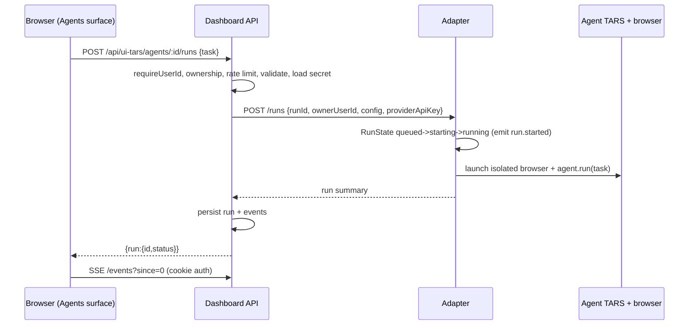
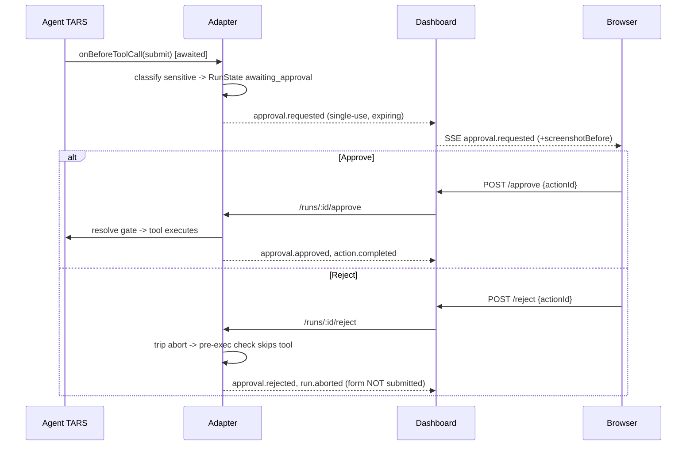
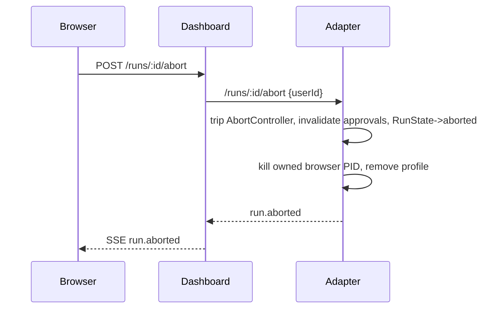
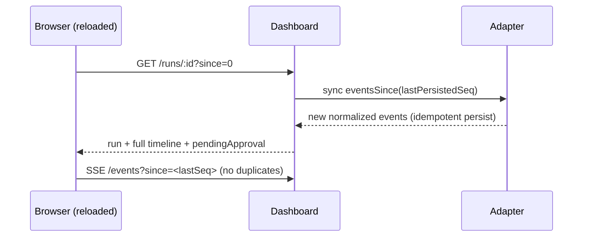

# UI-TARS — Operations & Reference

Companion to `UI_TARS_INTEGRATION.md` (architecture note) and
`UI_TARS_VERIFIED_INTEGRATION.md` (verified upstream findings).

## Architecture summary

```
Agents surface (Next.js client)       capability palette (/ button) -> Agents
      |                                tab -> "Agent TARS"; /agents deep link
      |                                browser; cookie-authenticated; no secrets
      |  /api/ui-tars/*  (requireUserId, ownership, rate limits, redaction)
Breadboard dashboard (Next.js server) control plane, SQLite persistence, audit
      |  loopback HTTP + bearer secret (127.0.0.1 only)
UI-TARS adapter (Node sidecar)        run state machine, approval enforcement,
      |  RuntimeClient boundary        event normalization, process ownership
Agent TARS runtimes (lazily loaded; only in agent-tars mode)
      |-- @agent-tars/core -> isolated Chromium/Edge (default)
      `-- @ui-tars/sdk + NutJS -> actual desktop (explicit approval required)
```

- **Process ownership**: the adapter launches the browser (dedicated profile),
  records its PID in `<data>/ui-tars/sessions/owned-processes.json`, kills it on
  abort/shutdown, and reaps proven-owned orphans on startup.
- **Authentication flow**: the browser calls Breadboard routes with the NextAuth
  session cookie (`requireUserId`). Breadboard calls the adapter with the
  per-install bearer secret. The adapter trusts the dashboard-asserted `userId`
  (proven by the bearer) and enforces run ownership by it — it is NOT a second
  auth system. The browser never sees the adapter port or secret.
- **Run lifecycle**: `queued -> starting -> running -> awaiting_approval <-> running
  -> {completed|failed|aborted|runtime_lost}`; terminal states never re-open;
  monotonic sequence numbers enable resume.
- **Approval enforcement**: at the verified `onBeforeToolCall` boundary — pause by
  awaiting the decision; reject trips abort so the pre-execution check skips the
  tool. Approvals are single-use, time-boxed, replay-safe, and per-run scoped.
- **Persistence**: agents, runs, normalized events (UNIQUE(run_id, seq) dedup),
  approvals, artifacts in SQLite; screenshots on disk under the data dir; refresh
  rebuilds from persisted events + a live adapter re-sync.
- **Browser isolation**: dedicated `userDataDir`, `profilePath` never set, no
  inherited cookies/extensions/password-manager, headless.
- **Actual desktop control**: opt-in per agent. Native screen capture and
  mouse/keyboard packages are not loaded until the user approves that run's
  high-risk `desktop_control` request. Stop/abort releases the agent promptly.
  This mode exposes GUI actions only, never Agent TARS shell/filesystem tools.

## Trust boundaries

| Boundary | Control |
| --- | --- |
| Browser <-> dashboard | NextAuth cookie; ownership checks; CSP on screenshot route; no secrets in responses |
| Dashboard <-> adapter | Loopback-only; timing-safe bearer secret; sanitized error codes |
| Adapter <-> runtime | In-process; provider key injected in memory only; never logged/persisted |
| Runtime <-> browser | Isolated profile; owned PID; killed on abort/shutdown |
| Runtime <-> actual desktop | Explicit per-run high-risk approval; visible warning; GUI-only action vocabulary; abortable |

## Installation & runtime prerequisites

1. Adapter deps (only for the real runtime): `cd ui-tars-adapter && npm install`.
   Pulls `@agent-tars/core@0.3.0`, `@tarko/*`, `@agent-infra/browser@0.2.2`,
   `@ui-tars/sdk@1.2.3`, `@ui-tars/operator-nut-js@1.2.3`, and their runtime
   dependencies. The packaged desktop stages this complete production closure.
2. A **Chrome or Edge** must be installed — `puppeteer-core` does not bundle
   Chromium; `@agent-infra/browser-finder` locates the system browser.
3. A **model endpoint** is required to actually drive the browser. New agents
   default to **ChatMock** (this install's local OpenAI-compatible gateway,
   serving GPT-5.6), so `dom` runs work with no extra setup as long as ChatMock
   is up. `gui`/`hybrid` need a vision-grounded provider — upstream only supports
   volcengine there and silently falls back to `dom` for everything else.
   Provider/model/endpoint/key stay per-agent (never in env) apart from
   ChatMock's own connection settings.
4. Node >= 20 (repo runs Node 24; adapter uses `--experimental-strip-types`).

## Model-provider configuration

Provider-agnostic: `provider`, `model`, optional `endpoint`, write-only `API key`.

Default provider: `chatmock`. Its endpoint comes from `CHATMOCK_BASE_URL` and its
credential from `CHATMOCK_API_KEY`, both read on the server at run start, so the
user never pastes a key; a per-agent key still wins if one is stored. The
provider id is passed to Agent TARS unchanged — upstream routes providers it does
not recognize through its `openai-compatible` client using the baseURL/apiKey we
supply. An agent on any other provider is "misconfigured" until a key is stored.

The key is stored in the server-only `ui_tars_agent_secrets` table, injected into
the adapter in-memory at run start, and never returned to the browser, placed in
argv, logged, or written to event payloads. Leave the key field blank to preserve
the stored value; check "Remove stored key" to delete it.

## Environment variables

| Variable | Default | Meaning |
| --- | --- | --- |
| `UI_TARS_MODE` | `optional` | `disabled` \| `optional` \| `required` |
| `UI_TARS_ADAPTER_URL` | `http://127.0.0.1:7719` | dashboard -> adapter (loopback) |
| `UI_TARS_ADAPTER_PORT` | `7719` | adapter bind port |
| `UI_TARS_ADAPTER_SECRET` | (per-install) | bearer secret; never sent to browser |
| `UI_TARS_DATA_DIR` | `~/.breadboard/ui-tars` | screenshots, profiles, session registry |
| `UI_TARS_RUNTIME` | `agent-tars` | `agent-tars` (real) \| `fake` (test-only) |
| `UI_TARS_MAX_CONCURRENT_RUNS` | `3` | global run ceiling |
| `UI_TARS_SCREENSHOT_RETENTION_MS` | `0` | screenshot retention sweep (`0` keeps chat-history screenshots; set an explicit duration to enable cleanup) |

## Data directories

```
<BreadboardData>/ui-tars/
  screenshots/<runId>/<seq>.png     served only via authenticated route
  browser-profiles/<runId>/         isolated Chromium/Edge profile
  sessions/owned-processes.json     PID ownership registry (for cleanup)
```
Mutable data never lives in the installed app directory.

## Approval behavior

- Default policy `sensitive_actions`; `every_action` gates everything.
- Always sensitive: **form submissions**, navigation off a non-empty allowlist,
  `browser_evaluate` (arbitrary JS), uploads, downloads, clipboard reads.
- Rejecting aborts the run (the action never executes). MVP does not "skip one
  tool and continue" — a documented later extension.
- Approvals are single-use and expire (default 5 min); replay/expired/cross-run
  decisions are rejected with 409.
- Actual-desktop mode always starts with one high-risk approval covering the
  screen, mouse, and keyboard for that run. `sensitive_actions` prompts once;
  `every_action` additionally pauses before every GUI interaction.

## Actual desktop mode

Select **Configure -> Control target -> Actual desktop**. Desktop mode captures
the currently visible primary display and operates the logged-in user's real
mouse and keyboard. Keep the intended app visible and avoid using input devices
while it runs. Windows text entry temporarily uses the clipboard and restores
the previous contents. The driver cannot cross Windows' secure desktop/UAC
boundary or control elevated applications from a non-elevated Breadboard.

## Domain restrictions

`allowedDomains` empty = unrestricted. Non-empty permits only listed apex domains
and their subdomains; navigation elsewhere requires approval (blocked on reject).

## Sequence diagrams

### 1. Starting a run



### 2-3. Approval request -> approve / reject



### 4. Aborting a run



### 5. Recovering after a frontend refresh



## How to verify process cleanup

1. Start a run (real runtime), then Stop it from the UI.
2. Inspect `<BreadboardData>/ui-tars/sessions/owned-processes.json` — the run's
   entry is gone.
3. On Windows, `Get-Process -Id <pid> -ErrorAction SilentlyContinue` returns
   nothing. The real-browser E2E asserts this automatically (PID dead after
   `close()`).

## How to disable UI-TARS

- Per environment: `UI_TARS_MODE=disabled` (adapter not started; agent shown
  disabled; the rest of Breadboard is unaffected).
- Desktop: set `uiTarsMode: "disabled"` in `desktop-config.json`.

## Windows packaging notes

- The adapter runs on the bundled Node runtime (`--experimental-strip-types`),
  supervised like the GBrain sidecar; optional mode never blocks startup.
- Only `ui-tars-adapter/` + its pinned deps are packaged — never the
  UI-TARS-desktop monorepo.
- **Chromium/Edge** is NOT bundled (`puppeteer-core`); the packaged app relies on a
  system Chrome/Edge located by `browser-finder`. Bundling a Chromium (or setting
  an executable path) is the remaining packaging task if a guaranteed browser is
  required offline.

## Troubleshooting

| Symptom | Likely cause / fix |
| --- | --- |
| Agents surface shows adapter "unavailable" | adapter not running or deps not installed (`cd ui-tars-adapter && npm install`); optional mode keeps Breadboard usable |
| Agent shows "misconfigured" | model empty, or a non-ChatMock provider without a stored key — configure provider/model/key |
| Run fails `browser_launch_failed` | no Chrome/Edge found by `browser-finder`; install one |
| Run `failed: model_not_configured` | set the model in the agent config |
| Real run never progresses past launch | no reachable/compatible model endpoint (with the default provider: ChatMock is not running) |

## Security limitations (residual)

- Provider keys are stored in a server-only SQLite table (not OS credential
  storage). Follow-up: move to Windows DPAPI/Credential Manager.
- `gui`/`hybrid` visual grounding needs a UI-TARS vision model; `dom` is the safe
  default.
- Rejection aborts the whole run (safe) rather than skipping a single tool.

## Test commands

```
npm run test:ui-tars          # 46 unit + adapter-integration tests (fake runtime)
npm run test:ui-tars:e2e      # real-browser isolation E2E (Chrome/Edge; else skips)
npm run test:dashboard        # includes tests/ui-tars.test.mjs (store/ownership/config)
npm run desktop:test          # includes ui-tars service-supervision tests
```
